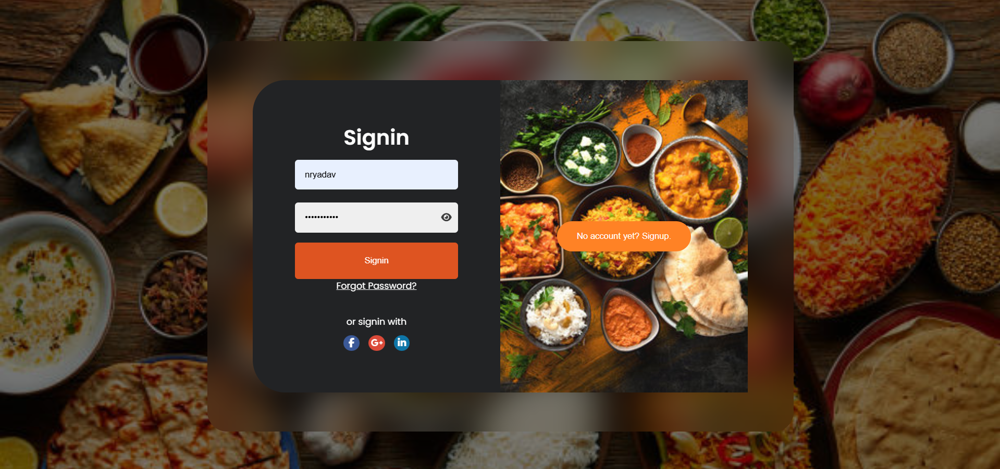
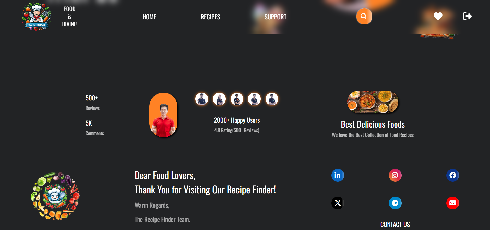
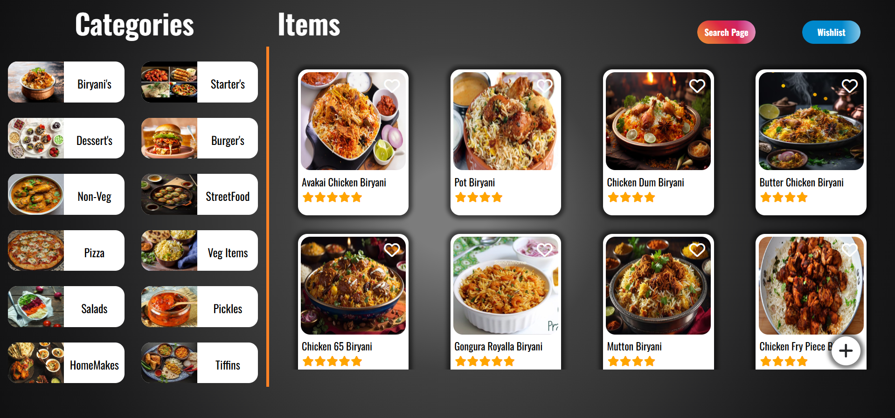
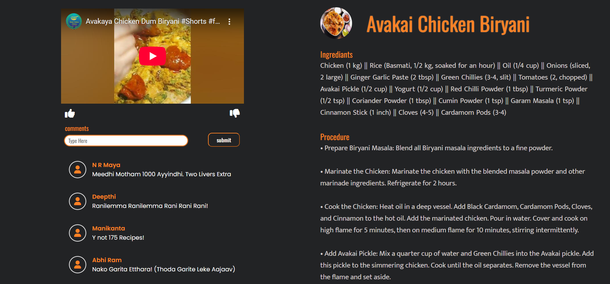
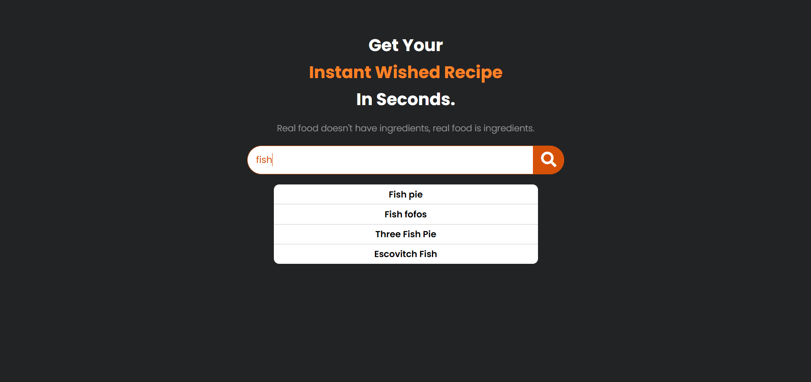
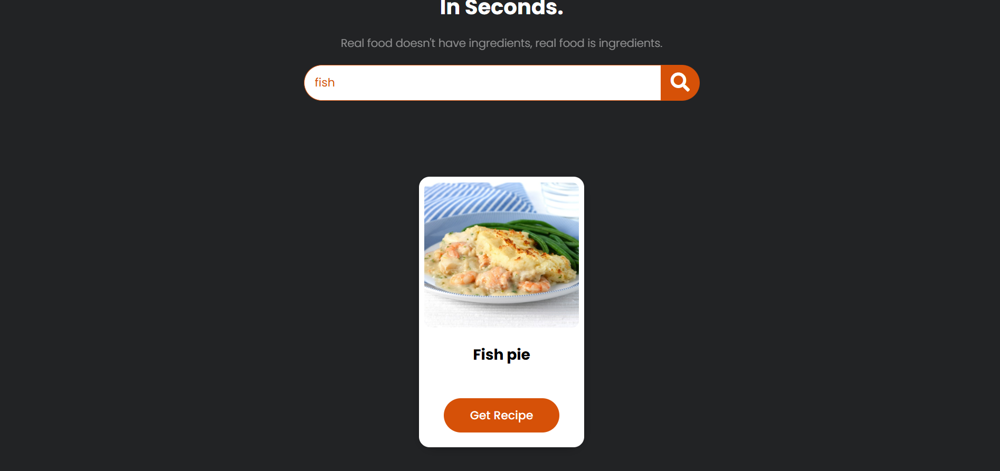
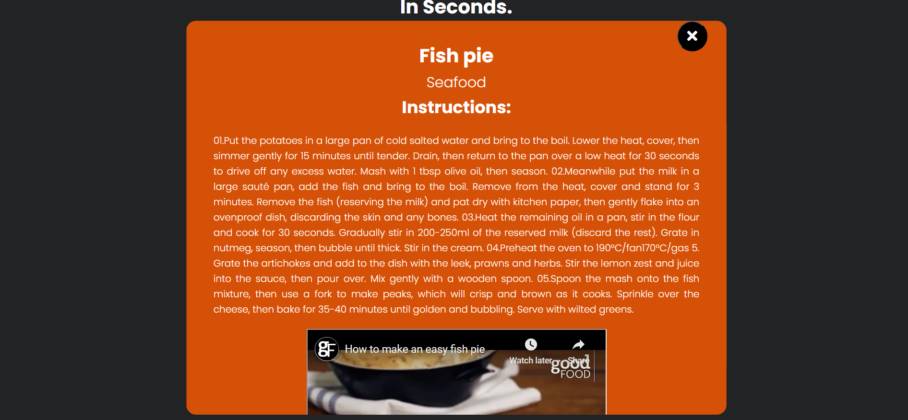
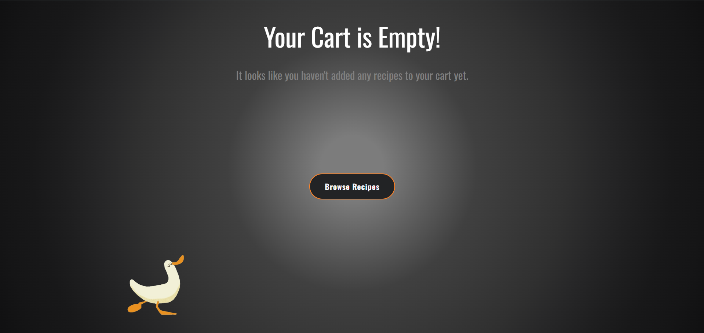

<h1 align="center">🍽️ Food Recipe Finder</h1>
<p align="center">
  A responsive and interactive web application that allows users to explore, search, and view a wide variety of recipes with an intuitive user interface.
</p> 

<p align="center">
  
  
  
</p>

---

## 📸 Preview Screenshots

> Click on images to enlarge (if supported on GitHub)

### 🔐 Login Page


### 🏠 Home Page (Top)


### 🏠 Home Page (Bottom)


### 🍳 Recipes Page


### 🍽️ Recipe View Page


### 🔎 Search Page


### 🧾 Item Searching Page


### 🍲 Searched Item View Page


### 💔 Empty Wishlist Page


---

## 🚀 Live Demo

> Add your GitHub Pages or deployed live site link here  
🌐 [Live Preview](https://food-recipe-finder-two.vercel.app)

---

## 🧰 Tech Stack

- HTML5
- CSS3
- JavaScript
- Local Storage/ Sessional Storage

---

## ✨ Features

- 🔐 Login and Signup (UI only)
- 🏠 Beautiful Home Page with recipe categories
- 🍳 Explore a list of popular recipes
- 🔍 Search recipes by ingredient or name
- 🧾 View recipe details with instructions
- 💔 Wishlist support (UI for empty state shown)
- 📱 Fully Responsive for mobile and tablet screens

---

## 📦 Installation Guide

> Follow these steps to run the project locally

# Clone the repository
```bash
git clone https://github.com/nryadav18/food-recipe-finder.git
```

# Navigate to the project folder
```bash
cd food-recipe-finder
```

### Open the index.html file in your Browser
### or 
### Open the index.html file in you VSC and Start the Development Server
